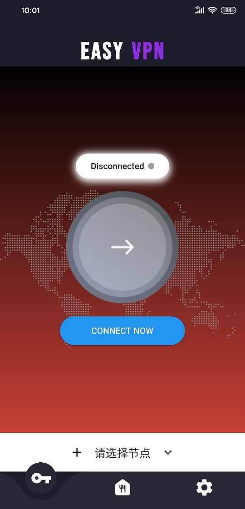
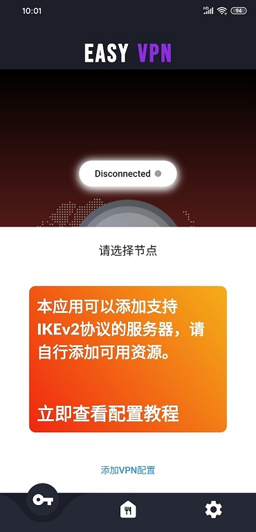
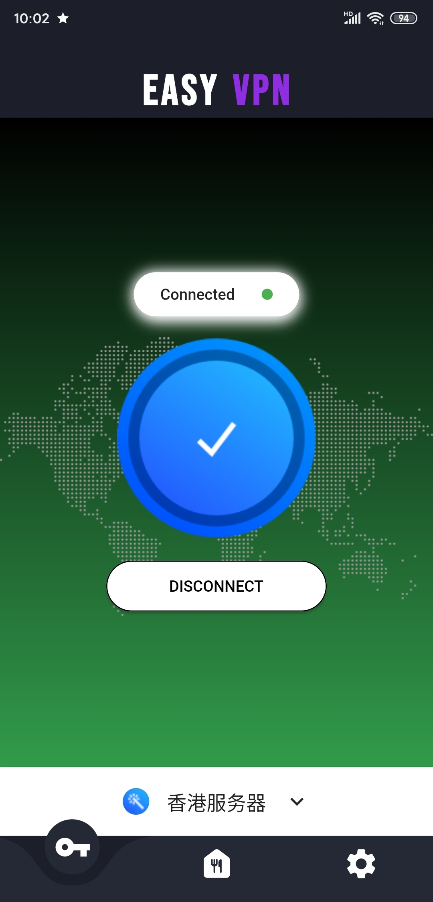
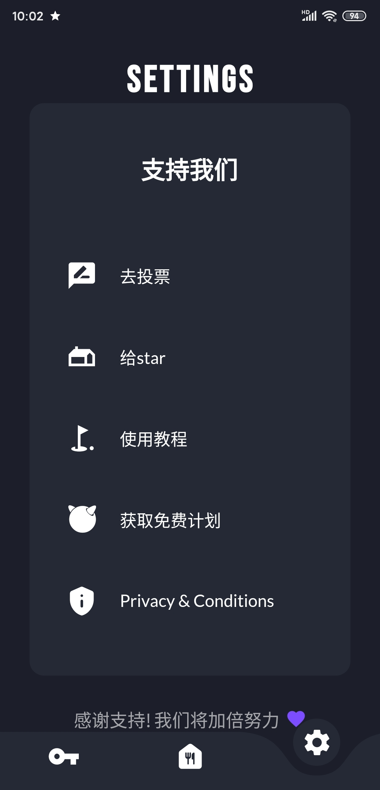

EASYVPN是一款使用Google近年主推跨平台框架Flutter开发的提供虚拟专用网络(VPN)服务的App。
支持IKEv2协议。
> IKEv2有着非常实用的自动重连特性，当用户暂时失去互联网连接（比如进出火车隧道）的时候，它会自动重新建立VPN连接。对于手机用户来说确实是喜大普奔。Ikev2能跑在几乎所有iOS定制的VPN应用上，为了那些使用苹果公司官方VPN
> API的人无需越狱来使用它（也正因为这些优势，能让VPN供应商能够很容易地把更新配置文件推送到使用VPN的用户或者应用程序上）。   
> 比PPTP，SSTP和L2TP更快，它不涉及在点对点协议（Point-to-Point protocols，PPP）上的开销 非常稳定 -
> 尤其是切换网络或者在短暂的网络连接丢失之后重新连接的时候 非常安全 - 支持AES 128，AES 192，AES
> 256以及3DES加密算法 易于安装和配置 - 至少在用户端是如此 协议也支持黑莓的设备 暂时还不支持很多的平台
> 在服务器上搭建IKEv2相对来说很费劲，这也是很多问题的隐患所在 我们所对它的信任仅因为它进行了开源

**下载：**

1，Android：

去googleplay： [下载](https://play.google.com/store/apps/details?id=app.easyvpn "下载")


2，Ios：暂无(欢迎自行构建测试)


**注意：**

1，使用本源码构建的任何App，只能用于外贸、学习、教育，娱乐、科研等合法用途；

2，使用本源码构建的App，请严格遵守所在地法律规定**

## 一，截图预览：







<br/>


## 二，特性介绍：
1，极简的UI设计，核心功能突出，
2，跨平台，理论上支持android和ios（ios未经验证）
3，用户无需安装证书，简单易用
4，IKEv2协议，无可比拟的安全性，稳定性和速度。

## 三，构建说明：


```shell
git clone https://github.com/shipinbaoku/easyvpn.git
cd easyvpn
flutter run
```


## 四，可以从这里获得免费可用资源：
[**点这里查看获得免费可用资源**](https://github.com/shipinbaoku/strongswans)